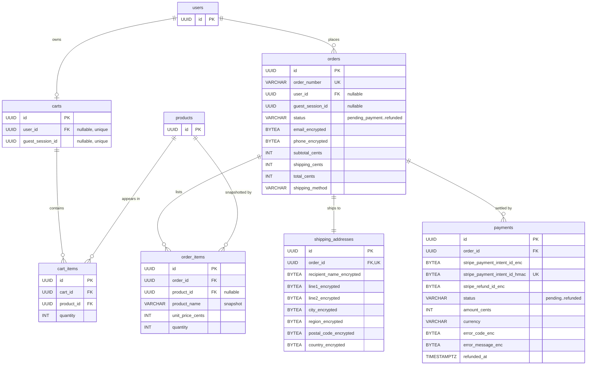

# Stora

[](https://github.com/IbrahimmSenn/stora-ecommerce/actions/workflows/pipeline.yml?query=branch%3Amain)

A full-stack e-commerce platform built with Go, PostgreSQL, RabbitMQ, and Docker. Covers the full commerce loop — catalog browsing, guest and persistent carts, single-page checkout, Stripe payments, webhook-driven order state, async email over a message queue, order history, and the cancellation + refund workflow — with order PII (contact + shipping address) encrypted at rest. Frontend is a React 19 + TypeScript storefront with a custom design system (OKLCH tokens, variable fonts, light/dark toggle, signature cart transition).

## Try it

The whole stack runs locally with one command (see [Quick start](#quick-start-local)) — Stripe stays in **test mode**, so no real money moves:

- Sign in as `customer@shop.com` / `customer123` (or register your own account, or check out as a guest).
- Pay with test card `4242 4242 4242 4242`, any future expiry, any CVC. `4000 0000 0000 9995` simulates an insufficient-funds decline.
- Cancel a paid order from **Orders** to see the idempotent Stripe refund flow.

The repo is also deployment-ready: a production compose overlay, TLS via Caddy, a hardened `DEMO_MODE`, and a CI deploy stage — see [Deployment](#deployment).

## Highlights

- **Layered Go backend** — handler → service → repository, interfaces everywhere, raw SQL via pgx (no ORM), mock-tested services.
- **Real payment lifecycle** — Stripe PaymentIntents, signature-verified webhooks, idempotent event handling, refunds, inventory locking (`SELECT ... FOR UPDATE` serialises concurrent checkouts on the last unit).
- **Event-driven email** — payment events flow through RabbitMQ topic exchanges to a notifications consumer with retry + dead-letter queue.
- **Security in depth** — JWT with refresh-token rotation and replay detection, TOTP 2FA (enforced for all admin accounts), RBAC (admin/support/sales/customer), reCAPTCHA v3, per-IP token-bucket rate limiting, AES-256-GCM encryption of PII at rest, audit logging of admin actions, and a boot-time production validator that refuses to start with insecure settings.
- **Full observability stack** — Prometheus + Grafana + Loki + Tempo: RED metrics with trace exemplars, SLO burn-rate alerts, business dashboards with a conversion funnel, distributed traces from HTTP through SQL to RabbitMQ, browser Core Web Vitals.
- **CI/CD pipeline** — five stages from tests and security scans through migration validation and an ephemeral-environment deployment rehearsal to continuous deployment on the live server, with scripted DB-backed rollback.

## Quick start (local)

Prerequisite: **Docker** + **Docker Compose**. That's it.

```bash
git clone https://github.com/IbrahimmSenn/stora-ecommerce.git
cd stora-ecommerce
cp .env.example .env       # fill in Stripe test keys + ENCRYPTION_KEY, others optional
make up                    # boots db, runs migrations, seeds, starts API
```

Open [http://localhost:8080](http://localhost:8080). To exercise Stripe end-to-end locally, run `stripe listen --forward-to http://localhost:8080/api/v1/webhooks/stripe` in a second terminal and paste the printed `whsec_...` into `.env`.

Seeded local accounts: `admin@shop.com` / `admin123` (admin — 2FA setup required on first admin visit) and `customer@shop.com` / `customer123`, plus a small mixed catalog (7 categories, 5 brands, 10 products, reviews). On public demo deployments the admin password comes from the `ADMIN_PASSWORD` env instead, and the admin dashboard is read-only — `DEMO_MODE=true` blocks all admin mutations while browsing orders, users, and the audit log still works.

### Bundled services

| Service | URL | Purpose |
|---|---|---|
| API + storefront | [http://localhost:8080](http://localhost:8080) | Go API and built React app |
| PostgreSQL | `localhost:5433` | Application database |
| RabbitMQ | [localhost:15672](http://localhost:15672) (`guest`/`guest`) | Inspect `payments.emails` and the DLQ |
| Mailhog | [localhost:8025](http://localhost:8025) | Captures every outgoing email |

### Make targets

`make up` / `make down` / `make reset` (fresh DB) / `make test` / `make build` / `make migrate-up` / `make migrate-down`. Observability: `make monitoring-up` / `make monitoring-down` / `make seed-history` / `make loadtest` / `make hostile`.

## Frontend

React 19 + TypeScript + Vite + Tailwind v4 storefront served at `/`. Header links: **Shop**, **Cart**, **Orders**, **Account** when logged in, **Admin** when the user has the admin role. The theme toggle on the far right cycles light / dark.

Routes:

| Path | What it covers |
|---|---|
| `/` | Catalog with featured tile + asymmetric grid |
| `/cart`, `/checkout`, `/orders/:id/pay`, `/orders/:id/confirmation` | Cart → checkout → Stripe → confirmation |
| `/orders`, `/orders/:id` | Order history (filter by status + date) and detail |
| `/register`, `/login` (optional 2FA prompt), `/forgot-password`, `/reset-password` | Account creation + recovery |
| `/auth/oauth/callback` | Lands here after Google / Facebook OAuth |
| `/account`, `/account/2fa/setup`, `/account/2fa/disable` | Profile + TOTP management |
| `/admin/products`, `/admin/categories`, `/admin/brands` | Admin CRUD (role-gated) |
| `/dev/tokens` | Token rotation + replay-detection tester (dev builds only) |

### Commerce walkthrough

1. Browse the catalog. Add to cart — the **signature cart panel** slides in from the right; the nav cart count pulses.
2. Log in mid-shopping. If both a guest cart and a user cart exist, you'll be prompted to merge or keep one.
3. `/checkout` — single page, contact (prefilled when authed), address, shipping method. Submitting creates the order in `pending_payment` and reserves stock.
4. Stripe Elements at `/orders/:id/pay`. Test cards: `4242 4242 4242 4242` (succeeds), `4000 0000 0000 0002` (decline), `4000 0000 0000 9995` (insufficient funds).
5. After success, the confirmation page polls until the webhook flips the order to `paid`, and a confirmation email goes out.
6. From `/orders`, cancel a `paid` order — Stripe issues an idempotent refund, stock restocks, status flips to `refunded`, and a refund email follows.
7. The RabbitMQ UI shows `payments.emails` incrementing on each event; stop the mail sink mid-payment and the message ends up in `payments.emails.dlq` after three retries.

Access tokens live **in memory only** — refreshing the tab clears authentication. `/dev/tokens` exposes the rotation flow and demonstrates refresh-token replay detection.

### Admin

The admin area at `/admin` (2FA-enforced) covers product CRUD with multi-size image upload and JSON/CSV bulk import, category/brand/delivery-option management, order status updates and refunds, user role assignment, review moderation, and an audit log of every admin action. RBAC follows least privilege: `support` sees Orders/Reviews, `sales` sees Products/Categories/Brands/Delivery, only `admin` sees everything.

### Theming

Tokens in [web/src/styles/tokens.css](web/src/styles/tokens.css) — near-monochrome OKLCH neutrals tinted toward an **oxblood** accent. Display face **Bricolage Grotesque Variable**, body **Hanken Grotesk Variable**, both self-hosted via `@fontsource-variable`. Light/dark persists in `localStorage` (first load reads `prefers-color-scheme`); motion collapses to instant under `prefers-reduced-motion: reduce`.

## API Reference

### Auth

| Method | Endpoint | Description |
|---|---|---|
| POST | `/api/v1/auth/register` | Email + password + captcha token |
| POST | `/api/v1/auth/login` | Returns access + refresh tokens; may require `totp_code` |
| POST | `/api/v1/auth/refresh` | Single-use refresh token rotation |
| POST | `/api/v1/auth/logout` | Bearer — revoke all sessions |
| POST | `/api/v1/auth/forgot-password` | Request reset email |
| POST | `/api/v1/auth/reset-password` | Redeem reset token |
| GET | `/api/v1/auth/oauth/{provider}` | Redirect to Google/Facebook consent |
| GET | `/api/v1/auth/oauth/{provider}/callback` | OAuth completion |
| POST | `/api/v1/auth/2fa/setup` / `enable` / `disable` | Bearer — TOTP lifecycle |

### Catalog (public)

| Method | Endpoint | Description |
|---|---|---|
| GET | `/api/v1/products` | Search: `q`, `category_id`, `brand_id`, `min_price`, `max_price`, `min_rating`, `sort`, `page`, `page_size` |
| GET | `/api/v1/products/suggest?q=` | Typeahead |
| GET | `/api/v1/products/{id}` | Detail with images and reviews |
| GET | `/api/v1/categories` / `/categories/{slug}` | Category tree / by slug |
| GET | `/api/v1/brands` / `/brands/{id}` | Brands |
| GET | `/api/v1/recommendations` | Personalised picks from activity + current cart contents |

### Cart, checkout, orders

All accept a bearer token OR a `guest_session` cookie (issued automatically on first cart interaction).

| Method | Endpoint | Description |
|---|---|---|
| GET / POST / PUT / DELETE | `/api/v1/cart`, `/cart/items`, `/cart/items/{productId}` | CRUD on cart lines (409 on insufficient stock) |
| GET | `/api/v1/cart/merge-status` | Logged-in only — describes what a merge would do |
| POST | `/api/v1/cart/merge` | Logged-in only — body `{strategy: "merge"\|"keep_user"\|"keep_guest"}` |
| POST | `/api/v1/checkout` | Creates order in `pending_payment`, reserves stock |
| GET | `/api/v1/orders` | Owner-scoped; filter by `status`, `from`, `to` (RFC3339) |
| GET | `/api/v1/orders/{id}` | Detail with decrypted address |
| POST | `/api/v1/orders/{id}/cancel` | Unpaid → `cancelled` (restocks). Paid → idempotent Stripe refund → `refunded` (restocks) |

Statuses: `pending_payment` → `paid` → `processing` → `shipped` → `delivered`, plus terminal `payment_failed` (retryable), `cancelled`, `refunded`.

### Payments

| Method | Endpoint | Description |
|---|---|---|
| POST | `/api/v1/orders/{id}/payment-intent` | Owner-checked — lazily creates a Stripe PaymentIntent, persists a `payments` row, returns `client_secret` + `publishable_key`. Safe to call after `payment_failed`. |
| POST | `/api/v1/webhooks/stripe` | Signature-verified. Handles `payment_intent.succeeded` and `payment_intent.payment_failed` — flips the order, persists payment metadata, publishes a JSON event to RabbitMQ. Idempotent. |
| GET | `/api/v1/config/stripe` / `/config/recaptcha` / `/config/demo` | Publishable keys + demo flag for the frontend |

### Admin (admin role required)

`POST /api/v1/admin/products`, `PUT /api/v1/admin/products/{id}`, `DELETE /api/v1/admin/products/{id}`, `POST /api/v1/admin/products/{id}/images`, `DELETE /api/v1/admin/products/{id}/images/{imageId}`, `POST /api/v1/admin/categories`, `POST /api/v1/admin/brands`.

### Messaging

Stripe webhook publishes to the `payments` topic exchange. A `notifications.email` consumer subscribes to `payments.emails` (bound to `payment.*`) and sends mail via SMTP. Failures retry in-process (200ms / 1s / 5s), then move to `payments.emails.dlq` via the `payments.dlx` fanout exchange.

| Routing key | Body |
|---|---|
| `payment.succeeded` | `{order_id, payment_intent_id, amount_cents, currency}` |
| `payment.failed` | `{order_id, payment_intent_id, amount_cents, currency, failure_code, failure_message}` |

## Architecture

```
HTTP → Handler (decode/validate) → Service (business logic) → Repository (SQL) → PostgreSQL
                                                            ↘ Event Publisher → RabbitMQ → Notifications Consumer → Mailer → SMTP
```

Each layer talks through Go interfaces — services are mock-tested in isolation. Raw SQL via pgx, no ORM. A `RefunderFunc` adapter wired in `cmd/api/main.go` breaks the `orders ↔ payments` cycle. The Stripe webhook updates the database synchronously (order is `paid` before the webhook returns 200); the confirmation email is a side effect over RabbitMQ.

This is a modular monolith built to split into services without a rewrite. Rate limiting and the read cache sit behind interfaces (in-memory by default, Redis via `REDIS_URL`) so the app scales horizontally behind a load balancer. See [docs/scaling.md](docs/scaling.md) for the seams, extraction order, and database scaling levers, and [docs/security.md](docs/security.md) for the CIA-triad data-protection model.

### Data model

The encrypted columns (`*_encrypted`, `*_enc`) are AES-256-GCM bytea — see [PII encryption at rest](#pii-encryption-at-rest).



Full schema including auth and catalog tables in [docs/erd.mmd](docs/erd.mmd).

### PII encryption at rest

Order contact (email, phone) and every field of the shipping address are stored as `bytea` ciphertext — AES-256-GCM with a 32-byte key from `ENCRYPTION_KEY`. Each value carries its own nonce; plaintext never lands in Postgres. Verify it after placing an order:

```bash
docker exec -it $(docker ps -qf name=db) psql -U admin -d mystore -c \
  "SELECT order_number, encode(email_encrypted, 'hex') FROM orders ORDER BY created_at DESC LIMIT 1;"
```

## Testing

```bash
make test                 # full Go test suite
cd web && npm run build   # type-check + production build
cd web && npm test        # Vitest frontend suite
```

What's covered:

- **Commerce services** — cart add/update/remove + merge strategies; orders checkout (rejects empty cart, stock-changed conflict, encrypted PII round-trip, ownership checks, cancel restocks, cancel-of-paid triggers refund, refund failure leaves status paid); payments (rejects non-payable status, persists intent, webhook flips + publishes event, idempotent on retries, bad signature rejected, refund is idempotent).
- **Notifications consumer** — succeeded routes to confirmation body, failed includes reason + code, terminal errors on bad payloads, retry semantics.
- **Identity / catalog** — JWT, login/refresh/logout/2FA/password-reset, category tree, product CRUD, middleware enforcement, security (SQL injection, XSS, JWT tampering, oversized bodies, malformed JSON, negative-value injection).
- **Frontend (Vitest + Testing Library)** — checkout form validation (required fields, email + phone + postal + country code, whitespace trimming) and the recommendations rail (loading, empty, render, error resilience).

### Concurrent payment guard

With one unit in stock, open two sessions and check the same product out in parallel — the second checkout fails with `409 stock or price changed while you were checking out`. `SELECT ... FOR UPDATE` on every cart line serialises the stock decrement.

## Load testing

k6 scenarios in [loadtest/](loadtest/) cover catalog browsing, search + add-to-cart, and full checkout, plus a hostile scenario (failed logins, rate-limit bursts, forged webhooks). Results and analysis — throughput, latency percentiles, breaking point, and identified bottlenecks — in [loadtest/REPORT.md](loadtest/REPORT.md).

## CI/CD

Every push runs the pipeline (GitHub Actions): **build & test** (Go + frontend suites with JUnit reports, plus the Go suite re-run inside Docker) → **security scan** (gosec SAST, govulncheck + npm audit dependency scanning, gitleaks over the full git history, trivy on the built image) → **database migration validation** (all migrations up from zero, newest one down/up, idempotent seed) → **core delivery** (deploy into an ephemeral compose environment, backup-then-migrate, smoke-test the critical user flows, publish the image to GHCR as a versioned rollback target) → **production deploy** (merges to `main` go live automatically: SSH to the server, `scripts/deploy.sh` pulls the image, backs up the DB, migrates, restarts, and smoke-tests against the public URL).

Deploys and rollbacks on any Docker host use the same scripts the pipeline runs: `scripts/deploy.sh <image>` and `scripts/rollback.sh <image> [backup.sql]`. Full documentation, gate policy, and the failure/rollback demo script: [docs/cicd.md](docs/cicd.md).

## Deployment

The project deploys to any Docker host from the same compose files as local dev, plus a production overlay ([docker-compose.prod.yml](docker-compose.prod.yml)): Caddy terminates TLS with an automatic Let's Encrypt certificate and proxies to the api container; Postgres, RabbitMQ, and the api itself publish no host ports. `DEMO_MODE=true` keeps every production security check (Secure cookies, HSTS, strict boot-time validation) while allowing Stripe test keys and the seeded demo catalog — with the admin password supplied via env, never the dev default. Merges to `main` auto-deploy via the pipeline's final stage once the server secrets are configured. The full server setup is documented step by step in [docs/deploy-checklist.md](docs/deploy-checklist.md).

## Observability

A Prometheus + Grafana + Loki + Tempo stack (compose profile, off by default)
covers technical health, business intelligence, and distributed tracing. The
API exposes Prometheus metrics on an internal `:9091` (HTTP RED metrics with
trace exemplars, DB query/pool metrics, business/security counters, and
browser-reported Core Web Vitals via `POST /api/v1/vitals`), ships slog JSON
logs to Loki via Promtail, and — with `OTEL_ENABLED=true` — exports OpenTelemetry
spans (HTTP → SQL → RabbitMQ publish/consume) to Tempo. Grafana also reads the
database directly through a column-restricted read-only role for the business
dashboards, and Prometheus scrapes RabbitMQ, Postgres, and Redis exporters for
dependency health.

```bash
make monitoring-up     # Prometheus (+SLO rules), Grafana, Loki, Promtail, Tempo, exporters
make seed-history      # ~60 days of backdated users/orders/reviews/funnel activity
make loadtest          # baseline browse/search/checkout traffic
make hostile           # failed logins, rate-limit bursts, forged webhooks (security panels)
```

Grafana at [http://localhost:3001](http://localhost:3001) (`admin`/`admin` locally)
serves five dashboards — **Business Intelligence**, **Product & Customer**
(with a view → cart → checkout → paid conversion funnel), **Technical
Performance**, **Security**, and **SLO / Error Budget** (99.5% availability +
95%-under-500ms latency SLOs with multi-window burn rates) — plus nine
provisioned alerts (infra symptoms, SLO burn-rate pairs, and a payment
success-ratio business alert), severity-routed: warnings to email, criticals
additionally to a Discord webhook. Full architecture, metric rationale, SLO
math, the tracing walkthrough, the alert runbook, and data-generation docs:
[docs/observability.md](docs/observability.md).

## Environment

`.env.example` lists every variable; only a handful are strictly required for a working stack:

- `DATABASE_URL`, `JWT_SECRET`, `ENCRYPTION_KEY` (generate with `openssl rand -hex 32`), `STRIPE_SECRET_KEY`, `STRIPE_WEBHOOK_SECRET`, `STRIPE_PUBLISHABLE_KEY`, `RABBITMQ_URL`.

Optional (features degrade gracefully if absent): `GOOGLE_CLIENT_ID/SECRET`, `FB_CLIENT_ID/SECRET`, `RECAPTCHA_SITE_KEY/SECRET_KEY` (set `SKIP_CAPTCHA=true` in dev), `SMTP_HOST/PORT/USER/PASS/FROM` (Mailhog handles this in compose).

`docker-compose.yml` overrides `DATABASE_URL`, `RABBITMQ_URL`, `SMTP_HOST`, `SMTP_PORT` so a `.env` copied verbatim from `.env.example` (with its localhost defaults) works unchanged inside the container network.

Booting with `APP_ENV=production` runs a strict validator that refuses placeholder secrets, `SKIP_CAPTCHA`, default DB/RabbitMQ credentials, non-HTTPS `BASE_URL`, or missing `CORS_ORIGINS`. `DEMO_MODE=true` relaxes exactly one thing for public demos — Stripe test keys are accepted — and in exchange requires `ADMIN_PASSWORD`.

## Project layout

```
cmd/api/main.go         entrypoint, dependency wiring, graceful shutdown
internal/
  auth/  user/          login, refresh, 2FA, password reset, profile
  brand/  category/  product/   catalog (faceted search + admin CRUD)
  captcha/  oauth/      reCAPTCHA v3 + Google/Facebook OAuth
  cart/                 guest + persistent carts, merge
  orders/               single-page checkout, history, cancel + refund
  payments/             Stripe intents, webhook, refunder, event publisher
  notifications/        consumer that turns payment events into emails
  messaging/            RabbitMQ connection, publisher, consumer, topology
  mailer/               SMTP sender (Mailhog / Brevo / any provider)
  crypto/               AES-256-GCM encryptor for order PII
  activity/  recommend/ event log + cart-aware recommendation service
  metrics/              Prometheus instrumentation (HTTP/DB/business/security)
  seed/                 demo + backdated historical data seeders
  middleware/           auth, admin role, optional auth, guest session, metrics, access log
  config/               env loading + production/demo validation
  ctxkey/  response/    shared context keys + JSON response helpers
cmd/seedhistory/        backdated data generator for the business dashboards
migrations/             39 migrations + seed.sql
observability/          Prometheus, Loki, Promtail configs + Grafana provisioning & dashboards
loadtest/               k6 scenarios (load.js, stress.js, hostile.js) + REPORT.md
web/                    React 19 + TypeScript + Vite + Tailwind v4 storefront
deploy/Caddyfile        TLS-terminating reverse proxy for server deployments
docs/                   ERD, security, scaling, CI/CD, observability, deploy checklist
Dockerfile              multi-stage: node → golang → alpine
docker-compose.yml      full stack + optional monitoring profile
docker-compose.prod.yml server overlay: Caddy + no public service ports
Makefile                dev commands
```
