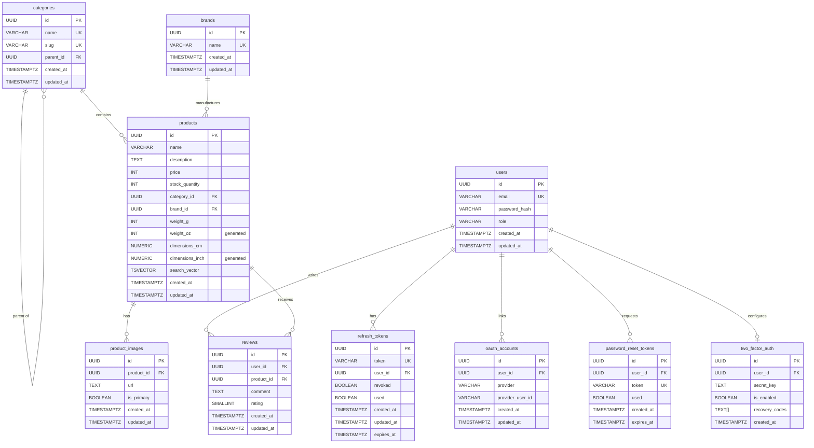

# I Love Shopping

A full-scale B2C e-commerce platform built with Go, PostgreSQL, and Docker. Includes a browser-based test panel for reviewers to interact with every feature without needing external tools.

## Features

- **Authentication**: Email/password registration and login with JWT (access + refresh tokens)
- **OAuth**: Google and Facebook social login
- **CAPTCHA**: Google reCAPTCHA v3 on registration
- **2FA**: Optional TOTP-based two-factor authentication with QR codes and recovery codes
- **Password Recovery**: Email-based password reset with secure one-time tokens
- **Refresh Token Rotation**: Single-use refresh tokens with replay detection
- **Product Catalog**: Full CRUD with faceted search, sorting, and pagination
- **Categories**: Hierarchical tree structure with nested browsing
- **Search**: PostgreSQL full-text search (tsvector/GIN index) with weighted ranking
- **Role-Based Access**: Customer and admin roles with middleware enforcement
- **Test Frontend**: Built-in browser UI for testing all features (register, login, OAuth, 2FA, products, admin)
- **Docker**: Fully containerized — Docker is the only host prerequisite
- **Seed Data**: Pre-loaded admin/customer accounts, categories, brands, products, and reviews

## Tech Stack

| Layer | Technology |
|-------|-----------|
| Language | Go 1.24+ |
| Router | Chi v5 |
| Database | PostgreSQL 16 |
| Auth | JWT (HS256), bcrypt, TOTP (pquerna/otp) |
| OAuth | golang.org/x/oauth2 (Google, Facebook) |
| Migrations | golang-migrate |
| Validation | go-playground/validator |
| Containers | Docker, docker-compose |
| Frontend | Vanilla HTML/CSS/JS (single-page test panel) |

## Entity Relationship Diagram



### Relationships Summary

| Relationship | Cardinality | Description |
|---|---|---|
| users → refresh_tokens | 1:N | A user can have many refresh tokens (multiple sessions) |
| users → oauth_accounts | 1:N | A user can link multiple OAuth providers |
| users → password_reset_tokens | 1:N | A user can request multiple resets |
| users → two_factor_auth | 1:0..1 | A user can optionally enable 2FA |
| users → reviews | 1:N | A user can write many reviews |
| categories → categories | 1:N (self) | Categories form a tree (parent_id) |
| categories → products | 1:N | A category contains many products |
| brands → products | 1:N | A brand has many products |
| products → product_images | 1:N | A product has many images |
| products → reviews | 1:N | A product receives many reviews |
| reviews (user_id, product_id) | UNIQUE | One review per user per product |

## Setup

### Prerequisites

- **Docker** and **Docker Compose** (only host requirements — all other dependencies are managed within containers)

### Quick Start

1. Clone the repository:
   ```bash
   git clone https://gitea.kood.tech/ibrahimsen/i-love-shopping.git
   cd i-love-shopping
   ```

2. Copy and configure the environment file:
   ```bash
   cp .env.example .env
   ```
   Edit `.env` to add your credentials for OAuth, reCAPTCHA, and SMTP (see [Environment Variables](#environment-variables) below). All features work without these — they simply enable the optional integrations.

3. Start everything:
   ```bash
   make up
   ```
   This starts PostgreSQL, runs all 14 migrations, seeds the database with sample data, and launches the API on port **8080**.

4. Open the test panel: [http://localhost:8080](http://localhost:8080)

5. Verify the API:
   ```bash
   curl http://localhost:8080/health
   # {"status":"ok"}
   ```

### Makefile Commands

| Command | Description |
|---------|-------------|
| `make up` | Build and start all Docker services |
| `make down` | Stop all services |
| `make reset` | Stop, delete database volume, rebuild and restart (fresh state) |
| `make run` | Run the API locally (requires local Go and PostgreSQL) |
| `make build` | Build the Go binary |
| `make test` | Run all automated tests |
| `make migrate-up` | Apply migrations (local development) |
| `make migrate-down` | Roll back migrations (local development) |

### Seed Data

The database is automatically seeded on startup with test data:

| Email | Password | Role |
|-------|----------|------|
| `admin@shop.com` | `admin123` | **admin** |
| `customer@shop.com` | `customer123` | customer |

Plus 7 categories (hierarchical), 5 brands, 10 products with images, and 9 reviews with ratings.

### Environment Variables

All credentials are loaded from the `.env` file (not committed to the repository). Copy `.env.example` and fill in the values you need.

| Variable | Required | Default | Description |
|----------|----------|---------|-------------|
| `DATABASE_URL` | Yes | — | PostgreSQL connection string |
| `JWT_SECRET` | Yes | — | Secret for signing JWTs |
| `PORT` | No | `8080` | API server port |
| `BASE_URL` | No | `http://localhost:8080` | Public base URL (for OAuth callbacks, reset links) |
| `BCRYPT_COST` | No | `10` | bcrypt hashing cost |
| `GOOGLE_CLIENT_ID` | No | — | Google OAuth client ID ([console.cloud.google.com](https://console.cloud.google.com/)) |
| `GOOGLE_CLIENT_SECRET` | No | — | Google OAuth client secret |
| `FB_CLIENT_ID` | No | — | Facebook OAuth client ID |
| `FB_CLIENT_SECRET` | No | — | Facebook OAuth client secret |
| `RECAPTCHA_SITE_KEY` | No | — | reCAPTCHA v3 site key ([google.com/recaptcha/admin](https://www.google.com/recaptcha/admin)) |
| `RECAPTCHA_SECRET_KEY` | No | — | reCAPTCHA v3 secret key |
| `SKIP_CAPTCHA` | No | `false` | Set `true` to skip CAPTCHA in development |
| `SMTP_HOST` | No | — | SMTP server host (empty = skip emails) |
| `SMTP_PORT` | No | `587` | SMTP port |
| `SMTP_USER` | No | — | SMTP username |
| `SMTP_PASS` | No | — | SMTP password |
| `SMTP_FROM` | No | (SMTP_USER) | Sender email address |

## Test Frontend

A built-in single-page test panel is served at `http://localhost:8080` when the application is running. It allows reviewers to test every feature through the browser without needing curl or Postman.

### Tabs

| Tab | What you can test |
|-----|-------------------|
| **Register** | Email/password registration with client-side validation; reCAPTCHA v3 auto-loads if `RECAPTCHA_SITE_KEY` is configured |
| **Login** | Login with email/password, optional 2FA TOTP code field, logout (token revocation) |
| **OAuth** | Google and Facebook login redirect buttons (requires OAuth env vars) |
| **Tokens** | View access token (stored in memory only), refresh token rotation, replay detection tester |
| **Password Reset** | Request reset email (step 1), reset password with token (step 2) |
| **2FA** | Setup (displays QR code + recovery codes), enable with TOTP code, disable |
| **Products** | Full-text search with faceted filters (category, brand, price range, rating), sorting, pagination, product detail with images, category tree, brand list |
| **Admin** | Create/update/delete products, add product images, create categories and brands (requires admin login) |

### Testing Walkthrough

1. **Browse Products**: Go to the Products tab and click Search — all 10 seeded products appear with images, prices, and ratings. Use the filters and sorting options to test faceted search.
2. **Register**: Go to Register tab, create a new account. If reCAPTCHA is configured, the token is sent automatically. Client-side validation checks email format and password length before submission.
3. **Login**: Go to Login tab. Login with `admin@shop.com` / `admin123` (admin) or `customer@shop.com` / `customer123` (customer). The header shows the logged-in user and role.
4. **Token Rotation**: Go to Tokens tab. Click "Refresh Tokens" — new access and refresh tokens are issued. The old refresh token is displayed. Paste it in the "Test Old Refresh Token" field and click "Try Old Token" — it will be rejected (replay detection). If the same old token is replayed, all sessions for that user are revoked.
5. **2FA**: Login, go to 2FA tab. Click "Setup 2FA" — a QR code and 8 recovery codes appear. Scan the QR with an authenticator app (Google Authenticator, Authy, etc.), enter the 6-digit code to enable. Logout and login again — now a TOTP code is required. Recovery codes also work for login and disabling 2FA.
6. **Admin Panel**: Login as admin, go to Admin tab. Create categories, brands, and products. Verify they appear in the Products tab. Update and delete products to test full CRUD.
7. **OAuth**: Click "Login with Google" on the OAuth tab. After authenticating with Google, you are redirected back and automatically logged in with tokens.
8. **Password Reset**: The password reset flow sends an email via SMTP with a reset token link. This will be demonstrated during the review call with SMTP credentials configured.

Access tokens are stored **in JavaScript memory only** (not localStorage or cookies) — refreshing the page clears authentication, demonstrating proper in-memory token storage.

## API Reference

### Authentication

| Method | Endpoint | Auth | Description |
|--------|----------|------|-------------|
| POST | `/api/v1/auth/register` | — | Register with email/password (+ captcha token) |
| POST | `/api/v1/auth/login` | — | Login (returns access + refresh tokens) |
| POST | `/api/v1/auth/refresh` | — | Rotate refresh token |
| POST | `/api/v1/auth/logout` | Bearer | Revoke all sessions |
| POST | `/api/v1/auth/forgot-password` | — | Request password reset email |
| POST | `/api/v1/auth/reset-password` | — | Reset password with token |

### OAuth

| Method | Endpoint | Description |
|--------|----------|-------------|
| GET | `/api/v1/auth/oauth/{provider}` | Redirect to Google/Facebook consent screen |
| GET | `/api/v1/auth/oauth/{provider}/callback` | OAuth callback (redirects to frontend with tokens) |

### Two-Factor Authentication

| Method | Endpoint | Auth | Description |
|--------|----------|------|-------------|
| POST | `/api/v1/auth/2fa/setup` | Bearer | Generate TOTP secret + QR code + recovery codes |
| POST | `/api/v1/auth/2fa/enable` | Bearer | Verify TOTP code to activate 2FA |
| POST | `/api/v1/auth/2fa/disable` | Bearer | Verify TOTP/recovery code to deactivate 2FA |

### Product Catalog (Public)

| Method | Endpoint | Description |
|--------|----------|-------------|
| GET | `/api/v1/products` | Search/filter products |
| GET | `/api/v1/products/suggest?q=` | Dynamic search suggestions (typeahead) |
| GET | `/api/v1/products/{id}` | Get product detail with images and reviews |
| GET | `/api/v1/categories` | Get category tree |
| GET | `/api/v1/categories/{slug}` | Get category by slug |
| GET | `/api/v1/brands` | List all brands |
| GET | `/api/v1/brands/{id}` | Get brand by ID |

**Search query parameters:**

| Param | Type | Example | Description |
|-------|------|---------|-------------|
| `q` | string | `wireless headphones` | Full-text search (tsvector) |
| `category_id` | UUID | `550e8400-...` | Filter by category |
| `brand_id` | UUID | `550e8400-...` | Filter by brand |
| `min_price` | int | `1000` | Min price in cents |
| `max_price` | int | `5000` | Max price in cents |
| `min_rating` | int | `4` | Minimum average rating |
| `sort` | string | `price_asc` | Sort: `relevance`, `price_asc`, `price_desc`, `rating` |
| `page` | int | `1` | Page number |
| `page_size` | int | `20` | Items per page (max 100) |

### Admin (Requires admin role)

| Method | Endpoint | Description |
|--------|----------|-------------|
| POST | `/api/v1/admin/products` | Create product |
| PUT | `/api/v1/admin/products/{id}` | Update product |
| DELETE | `/api/v1/admin/products/{id}` | Delete product |
| POST | `/api/v1/admin/products/{id}/images` | Add product image |
| DELETE | `/api/v1/admin/products/{id}/images/{imageId}` | Delete product image |
| POST | `/api/v1/admin/categories` | Create category |
| POST | `/api/v1/admin/brands` | Create brand |

## Testing

### Automated Tests

Run the full test suite:
```bash
make test
```

The test suite includes **11 test files** across 5 packages:

**Unit Tests:**
- JWT token generation and validation (access + refresh tokens, expiry, claims)
- Auth service logic (login flow, refresh rotation, 2FA verification, password reset)
- User registration validation (email format, password length, duplicate detection)
- Category tree builder (hierarchical nesting from flat list)
- Product service (CRUD operations, search parameter handling)

**API Integration Tests:**
- Login, refresh, logout endpoint request/response validation
- Product CRUD endpoints (create, update, delete, search, image management)
- Middleware enforcement (auth required, admin role required)

**Security Tests:**
- SQL injection attempts across auth and product endpoints
- XSS payload injection in user inputs
- Malformed JSON and oversized request bodies
- JWT token tampering (modified payload, invalid signature, expired tokens)
- User enumeration prevention (forgot-password returns same response for existing/non-existing emails)
- Invalid UUID injection
- Negative value injection for price, stock, weight fields

### Manual Testing via Frontend

The browser test panel at `http://localhost:8080` covers all features interactively. See the [Testing Walkthrough](#testing-walkthrough) section above.

### Password Reset Testing

Password reset requires SMTP configuration to send emails. This will be demonstrated during the review call with live SMTP credentials. The implementation:
1. `POST /api/v1/auth/forgot-password` generates a secure random token (32 bytes, base32-encoded), stores it with a 1-hour expiry, and sends an HTML email with the reset link
2. `POST /api/v1/auth/reset-password` validates the token, hashes the new password, updates the user, marks the token as used, and revokes all existing sessions
3. The endpoint returns the same response regardless of whether the email exists (prevents user enumeration)

## Project Structure

```
.
├── cmd/api/main.go              # Application entrypoint and dependency wiring
├── internal/
│   ├── auth/                    # Authentication (login, refresh, 2FA, password reset)
│   │   ├── handler.go           # HTTP handlers
│   │   ├── service.go           # Business logic
│   │   ├── repository.go        # Database operations
│   │   ├── token.go             # JWT generation/validation
│   │   ├── model.go             # Request/response types
│   │   ├── errors.go            # Domain errors
│   │   └── *_test.go            # Unit, integration, and security tests
│   ├── brand/                   # Brand management (handler/service/repository)
│   ├── captcha/                 # reCAPTCHA v3 verification
│   ├── category/                # Category tree management
│   ├── config/                  # Environment configuration loader
│   ├── ctxkey/                  # Shared context keys (avoids import cycles)
│   ├── mailer/                  # SMTP email sender
│   ├── middleware/              # Auth and admin role middleware
│   ├── oauth/                   # OAuth providers (Google, Facebook)
│   ├── product/                 # Product catalog with faceted search
│   ├── response/                # JSON response helpers
│   └── user/                    # User registration
├── migrations/                  # PostgreSQL migration files (001-014) + seed.sql
├── static/                      # Frontend test panel (index.html)
├── Dockerfile                   # Multi-stage build (golang:alpine → alpine:3.20)
├── docker-compose.yml           # Full stack (db + migrate + seed + api)
├── Makefile                     # Dev commands (up, down, reset, test, etc.)
└── .env.example                 # Environment variable template
```

## Architecture

The project follows a clean layered architecture:

```
HTTP Request → Handler (decode/validate) → Service (business logic) → Repository (database) → PostgreSQL
```

Each layer communicates through Go interfaces, enabling testability with mock implementations. Import cycles are avoided using function injection and a shared `ctxkey` package.

### Docker Services

| Service | Image | Purpose |
|---------|-------|---------|
| `db` | postgres:16-alpine | PostgreSQL database with persistent volume |
| `migrate` | migrate/migrate | Runs all 14 migration files on startup |
| `seed` | postgres:16-alpine | Seeds the database with test accounts, products, and reviews |
| `api` | Custom (multi-stage) | Go API server serving both the REST API and the test frontend |

All services are orchestrated with health checks and dependency ordering. Credentials are loaded from the `.env` file via `env_file` directive — no secrets are hardcoded in the compose file.

`make up` is the only command needed to run the entire stack.
