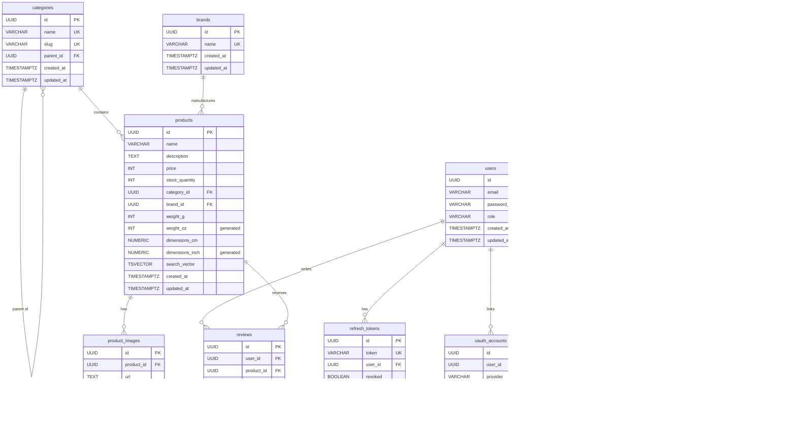

# I Love Shopping

A full-scale B2C e-commerce platform built with Go, PostgreSQL, and Docker. Includes a browser-based test panel for reviewers to interact with every feature without needing external tools.

## Features

- **Authentication**: Email/password registration and login with JWT (access + refresh tokens)
- **OAuth**: Google and Facebook social login
- **CAPTCHA**: Google reCAPTCHA v3 on registration
- **2FA**: Optional TOTP-based two-factor authentication with QR codes and recovery codes
- **Password Recovery**: Email-based password reset with secure one-time tokens
- **Refresh Token Rotation**: Single-use refresh tokens with replay detection
- **Product Catalog**: Full CRUD with faceted search, sorting, and pagination
- **Categories**: Hierarchical tree structure with nested browsing
- **Search**: PostgreSQL full-text search (tsvector/GIN index) with weighted ranking
- **Role-Based Access**: Customer and admin roles with middleware enforcement
- **Test Frontend**: Built-in browser UI for testing all features (register, login, OAuth, 2FA, products, admin)
- **Docker**: Fully containerized — Docker is the only host prerequisite
- **Seed Data**: Pre-loaded admin/customer accounts, categories, brands, products, and reviews

## Tech Stack

| Layer | Technology |
|-------|-----------|
| Language | Go 1.24+ |
| Router | Chi v5 |
| Database | PostgreSQL 16 |
| Auth | JWT (HS256), bcrypt, TOTP (pquerna/otp) |
| OAuth | golang.org/x/oauth2 (Google, Facebook) |
| Migrations | golang-migrate |
| Validation | go-playground/validator |
| Containers | Docker, docker-compose |
| Frontend | Vanilla HTML/CSS/JS (single-page test panel) |

## Entity Relationship Diagram



### Relationships Summary

| Relationship | Cardinality | Description |
|---|---|---|
| users → refresh_tokens | 1:N | A user can have many refresh tokens (multiple sessions) |
| users → oauth_accounts | 1:N | A user can link multiple OAuth providers |
| users → password_reset_tokens | 1:N | A user can request multiple resets |
| users → two_factor_auth | 1:0..1 | A user can optionally enable 2FA |
| users → reviews | 1:N | A user can write many reviews |
| categories → categories | 1:N (self) | Categories form a tree (parent_id) |
| categories → products | 1:N | A category contains many products |
| brands → products | 1:N | A brand has many products |
| products → product_images | 1:N | A product has many images |
| products → reviews | 1:N | A product receives many reviews |
| reviews (user_id, product_id) | UNIQUE | One review per user per product |

## Setup

### Prerequisites

- **Docker** and **Docker Compose** (only host requirements)

### Quick Start

1. Clone the repository:
   ```bash
   git clone https://gitea.kood.tech/ibrahimsen/i-love-shopping.git
   cd i-love-shopping
   ```

2. Copy the environment file and configure:
   ```bash
   cp .env.example .env
   ```

3. Start everything:
   ```bash
   docker compose up --build
   ```

   This starts PostgreSQL, runs all migrations, seeds the database with sample data, and launches the API on port **8080**.

4. Open the test panel in your browser:
   ```
   http://localhost:8080
   ```

5. Verify the API is running:
   ```bash
   curl http://localhost:8080/health
   # {"status":"ok"}
   ```

### Seed Data

The database is automatically seeded on startup with test data:

| Email | Password | Role |
|-------|----------|------|
| `admin@shop.com` | `admin123` | **admin** |
| `customer@shop.com` | `customer123` | customer |

Plus 7 categories (hierarchical), 5 brands, 10 products with images, and 9 reviews with ratings.

### Environment Variables

| Variable | Required | Default | Description |
|----------|----------|---------|-------------|
| `DATABASE_URL` | Yes | — | PostgreSQL connection string |
| `JWT_SECRET` | Yes | — | Secret for signing JWTs |
| `PORT` | No | `8080` | API server port |
| `BASE_URL` | No | `http://localhost:8080` | Public base URL (for OAuth callbacks, reset links) |
| `BCRYPT_COST` | No | `10` | bcrypt hashing cost |
| `GOOGLE_CLIENT_ID` | No | — | Google OAuth client ID |
| `GOOGLE_CLIENT_SECRET` | No | — | Google OAuth client secret |
| `FB_CLIENT_ID` | No | — | Facebook OAuth client ID |
| `FB_CLIENT_SECRET` | No | — | Facebook OAuth client secret |
| `RECAPTCHA_SITE_KEY` | No | — | reCAPTCHA v3 site key |
| `RECAPTCHA_SECRET_KEY` | No | — | reCAPTCHA v3 secret key |
| `SKIP_CAPTCHA` | No | `false` | Set `true` to skip CAPTCHA in development |
| `SMTP_HOST` | No | — | SMTP server host (empty = skip emails) |
| `SMTP_PORT` | No | `587` | SMTP port |
| `SMTP_USER` | No | — | SMTP username |
| `SMTP_PASS` | No | — | SMTP password |
| `SMTP_FROM` | No | (SMTP_USER) | Sender email address |

## Test Frontend

A built-in single-page test panel is served at `http://localhost:8080` when the application is running. It allows reviewers to test every feature through the browser without needing curl or Postman.

### Tabs

| Tab | What you can test |
|-----|-------------------|
| **Register** | Email/password registration with client-side validation; reCAPTCHA v3 auto-loads if `RECAPTCHA_SITE_KEY` is configured |
| **Login** | Login with email/password, optional 2FA TOTP code field, logout (token revocation) |
| **OAuth** | Google and Facebook login redirect buttons (requires OAuth env vars) |
| **Tokens** | View access token (stored in memory only), refresh token rotation, replay detection tester |
| **Password Reset** | Request reset email (step 1), reset password with token (step 2) |
| **2FA** | Setup (displays QR code + recovery codes), enable with TOTP code, disable |
| **Products** | Full-text search with faceted filters (category, brand, price range, rating), sorting, pagination, product detail view, category tree, brand list |
| **Admin** | Create/update/delete products, add product images, create categories and brands (requires admin login) |

### Testing Walkthrough

1. **Products**: Go to the Products tab and click Search to browse all seeded products. Load categories and brands to populate filter dropdowns.
2. **Auth**: Register a new account on the Register tab, or login with `admin@shop.com` / `admin123`.
3. **Token Rotation**: Go to the Tokens tab, click Refresh to rotate tokens. Copy the old refresh token and paste it in the replay detection field to verify it gets rejected.
4. **2FA**: Login, go to the 2FA tab, click Setup to get a QR code. Scan with an authenticator app, enter the code to enable. Then test login with 2FA on the Login tab.
5. **Admin**: Login as admin, go to the Admin tab to create categories, brands, and products. Verify they appear in the Products tab search.
6. **Password Reset**: Enter an email on the Password Reset tab. If SMTP is configured, check the email for the reset token. Paste it to reset the password.

Access tokens are stored **in JavaScript memory only** (not localStorage or cookies) — refreshing the page clears authentication, demonstrating proper in-memory token storage.

## API Reference

### Authentication

| Method | Endpoint | Auth | Description |
|--------|----------|------|-------------|
| POST | `/api/v1/auth/register` | — | Register with email/password (+ captcha token) |
| POST | `/api/v1/auth/login` | — | Login (returns access + refresh tokens) |
| POST | `/api/v1/auth/refresh` | — | Rotate refresh token |
| POST | `/api/v1/auth/logout` | Bearer | Revoke all sessions |
| POST | `/api/v1/auth/forgot-password` | — | Request password reset email |
| POST | `/api/v1/auth/reset-password` | — | Reset password with token |

### OAuth

| Method | Endpoint | Description |
|--------|----------|-------------|
| GET | `/api/v1/auth/oauth/{provider}` | Redirect to Google/Facebook consent screen |
| GET | `/api/v1/auth/oauth/{provider}/callback` | OAuth callback (returns tokens) |

### Two-Factor Authentication

| Method | Endpoint | Auth | Description |
|--------|----------|------|-------------|
| POST | `/api/v1/auth/2fa/setup` | Bearer | Generate TOTP secret + QR code + recovery codes |
| POST | `/api/v1/auth/2fa/enable` | Bearer | Verify TOTP code to activate 2FA |
| POST | `/api/v1/auth/2fa/disable` | Bearer | Verify TOTP code to deactivate 2FA |

### Product Catalog (Public)

| Method | Endpoint | Description |
|--------|----------|-------------|
| GET | `/api/v1/products` | Search/filter products |
| GET | `/api/v1/products/{id}` | Get product by ID |
| GET | `/api/v1/categories` | Get category tree |
| GET | `/api/v1/categories/{slug}` | Get category by slug |
| GET | `/api/v1/brands` | List all brands |
| GET | `/api/v1/brands/{id}` | Get brand by ID |

**Search query parameters:**

| Param | Type | Example | Description |
|-------|------|---------|-------------|
| `q` | string | `wireless headphones` | Full-text search (tsvector) |
| `category_id` | UUID | `550e8400-...` | Filter by category |
| `brand_id` | UUID | `550e8400-...` | Filter by brand |
| `min_price` | int | `1000` | Min price in cents |
| `max_price` | int | `5000` | Max price in cents |
| `min_rating` | float | `4.0` | Minimum average rating |
| `sort` | string | `price_asc` | Sort: `relevance`, `price_asc`, `price_desc`, `rating` |
| `page` | int | `1` | Page number |
| `page_size` | int | `20` | Items per page (max 100) |

### Admin (Requires admin role)

| Method | Endpoint | Description |
|--------|----------|-------------|
| POST | `/api/v1/admin/products` | Create product |
| PUT | `/api/v1/admin/products/{id}` | Update product |
| DELETE | `/api/v1/admin/products/{id}` | Delete product |
| POST | `/api/v1/admin/products/{id}/images` | Add product image |
| DELETE | `/api/v1/admin/products/{id}/images/{imageId}` | Delete product image |
| POST | `/api/v1/admin/categories` | Create category |
| POST | `/api/v1/admin/brands` | Create brand |

### Configuration (Public)

| Method | Endpoint | Description |
|--------|----------|-------------|
| GET | `/api/v1/config/recaptcha` | Returns the reCAPTCHA site key (used by frontend) |
| GET | `/health` | Health check |

## Usage Examples

### Register
```bash
curl -X POST http://localhost:8080/api/v1/auth/register \
  -H "Content-Type: application/json" \
  -d '{"email": "user@example.com", "password": "securepass123"}'
```

### Login
```bash
curl -X POST http://localhost:8080/api/v1/auth/login \
  -H "Content-Type: application/json" \
  -d '{"email": "admin@shop.com", "password": "admin123"}'
```

Response:
```json
{
  "access_token": "eyJhbGciOiJIUzI1NiIs...",
  "refresh_token": "eyJhbGciOiJIUzI1NiIs...",
  "expires_at": "2025-01-01T00:15:00Z",
  "token_type": "Bearer"
}
```

### Login with 2FA
```bash
curl -X POST http://localhost:8080/api/v1/auth/login \
  -H "Content-Type: application/json" \
  -d '{"email": "user@example.com", "password": "securepass123", "totp_code": "123456"}'
```

### Search Products
```bash
curl "http://localhost:8080/api/v1/products?q=headphones&min_price=2000&max_price=10000&sort=price_asc&page=1"
```

### Refresh Token
```bash
curl -X POST http://localhost:8080/api/v1/auth/refresh \
  -H "Content-Type: application/json" \
  -d '{"refresh_token": "eyJhbGciOiJIUzI1NiIs..."}'
```

### Create Product (Admin)
```bash
curl -X POST http://localhost:8080/api/v1/admin/products \
  -H "Content-Type: application/json" \
  -H "Authorization: Bearer <access_token>" \
  -d '{
    "name": "Wireless Mouse",
    "description": "Ergonomic wireless mouse with USB-C charging",
    "price": 2999,
    "stock_quantity": 100,
    "weight_g": 85,
    "dimensions_cm": 12.5,
    "category_id": "ca000000-0000-0000-0000-000000000001",
    "brand_id": "b0000000-0000-0000-0000-000000000004"
  }'
```

## Testing

Run all tests:
```bash
go test ./... -v
```

Or using Docker (no local Go installation required):
```bash
docker compose up -d db
# Wait for DB to be ready, then:
make test
```

The test suite includes:
- **Unit tests**: JWT generation/validation, auth service logic, user registration validation, category tree builder, product service
- **API integration tests**: Login, refresh, logout, product CRUD, search, image management endpoints
- **Security tests**: SQL injection, XSS payloads, malformed JSON, oversized payloads, token tampering, user enumeration prevention

## Project Structure

```
.
├── cmd/api/main.go              # Application entrypoint and dependency wiring
├── internal/
│   ├── auth/                    # Authentication (login, refresh, 2FA, password reset)
│   ├── brand/                   # Brand management
│   ├── captcha/                 # reCAPTCHA v3 verification
│   ├── category/                # Category tree management
│   ├── config/                  # Environment configuration
│   ├── ctxkey/                  # Shared context keys (breaks import cycles)
│   ├── mailer/                  # SMTP email sender
│   ├── middleware/              # Auth and admin role middleware
│   ├── oauth/                   # OAuth providers (Google, Facebook)
│   ├── product/                 # Product catalog with faceted search
│   ├── response/                # JSON response helpers
│   └── user/                    # User registration
├── migrations/                  # PostgreSQL migration files (001-014) + seed.sql
├── static/                      # Frontend test panel (index.html)
├── Dockerfile                   # Multi-stage build
├── docker-compose.yml           # Full stack (db + migrate + seed + api)
└── Makefile                     # Dev commands
```

## Architecture

The project follows a clean layered architecture:

```
HTTP Request → Handler (decode/validate) → Service (business logic) → Repository (database) → PostgreSQL
```

Each layer communicates through Go interfaces, enabling testability with mock implementations. Import cycles are avoided using function injection and a shared `ctxkey` package.

### Docker Services

| Service | Image | Purpose |
|---------|-------|---------|
| `db` | postgres:16-alpine | PostgreSQL database with persistent volume |
| `migrate` | migrate/migrate | Runs all 14 migration files on startup |
| `seed` | postgres:16-alpine | Seeds the database with test accounts, products, and reviews |
| `api` | Custom (multi-stage) | Go API server serving both the REST API and the test frontend |

All services are orchestrated with health checks and dependency ordering — `docker compose up --build` is the only command needed to run the entire stack.
